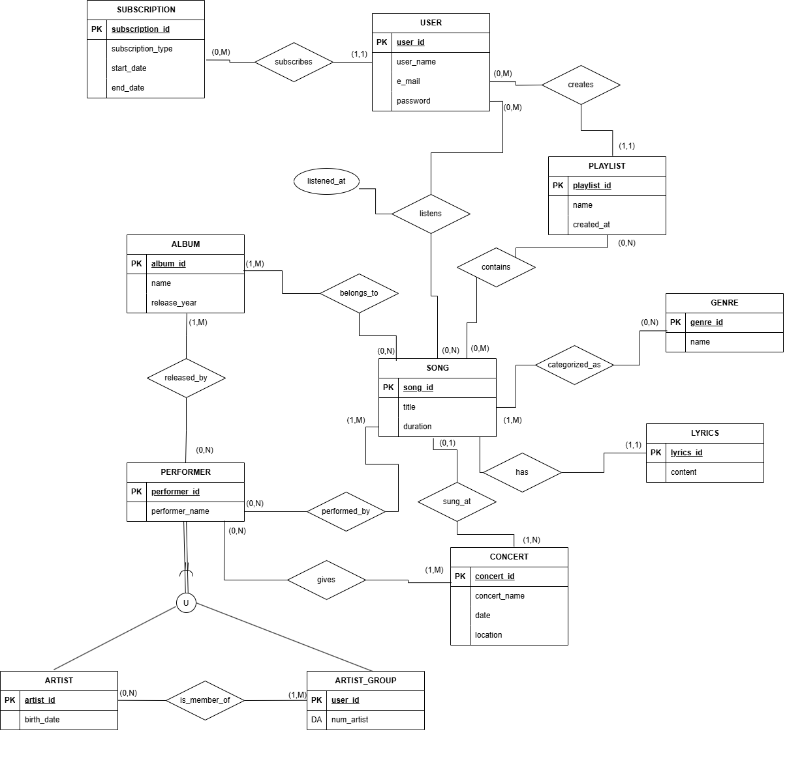

# TOBBify: A Music Database Management System

TOBBify is a comprehensive music database management system designed to enhance the way users organize and interact with their music collections. The project combines advanced database management, full-text search capabilities, and a user-friendly interface to cater to casual listeners and industry professionals alike.

---

## Table of Contents
1. [Project Overview](#project-overview)
2. [Features](#features)
3. [Technologies Used](#technologies-used)
4. [Database Schema](#database-schema)
5. [Setup Instructions](#setup-instructions)
6. [Usage](#usage)
7. [Future Enhancements](#future-enhancements)
8. [Contributors](#contributors)

---

## Project Overview

The TOBBify system is built to:
- Centralize the management of music-related data such as songs, albums, artists, and playlists.
- Support advanced features like playlist management, music recommendations, and full-text search for lyrics.
- Scale efficiently to accommodate growing datasets and user interactions.

---

## Features

1. **Filtering Songs**: Filter songs based on genre, artist, release year, and metadata (e.g., danceability, energy).
2. **Full-Text Search**: Search for songs by lyrics or titles with optimized PostgreSQL indexing.
3. **Playlist Management**: Create, update, and organize playlists dynamically.
4. **Personalized Recommendations**: Get tailored song suggestions based on playback history.
5. **Scalable Architecture**: Handle large datasets with optimized queries and relationships.
6. **Interactive User Interface**: Real-time music exploration using Streamlit.

---

## Technologies Used

### **Backend**
- **Python**: For backend logic and database interaction.
  - Libraries: `SQLAlchemy`, `Pandas`, `psycopg2`.

### **Database**
- **PostgreSQL**: For relational database management, full-text search, and efficient queries.

### **Frontend**
- **Streamlit**: For building an intuitive and interactive web interface.

### **Data Preprocessing**
- **CSV Files**: Dataset of 28,000+ songs (`dataset.csv`) used for populating the database.
- **Python Scripts**:
  - `populate_database.py`: Loads the dataset into the PostgreSQL database.
  - `random_user.py`: Generates mock user data for testing.

### **CI/CD**
- **GitHub Actions**: For continuous integration and deployment, ensuring code quality and seamless updates.

### **Version Control**
- **Git and GitHub**: For team collaboration and version control.

---

## Database Schema

The TOBBify database schema includes:
- **Entities**: `Users`, `Songs`, `Playlists`, `Albums`, `Artists`, `Genres`, `Lyrics`, and more.
- **Relationships**:
  - One-to-Many: `Albums ↔ Songs`, `Users ↔ Playlists`.
  - Many-to-Many: `Playlists ↔ Songs`, `Songs ↔ Genres`.
  - Optional: `Songs ↔ Lyrics` (one-to-one, optional).
- **Inheritance**: `Performers` generalized into `Artists` and `Artist Groups`.

The detailed Entity-Relationship Diagram (EER) is as follows:



The Relational Schema After Normalization of Tables:


---

## Setup Instructions

1. **Install and Set Up PostgreSQL**:
   - Download and install PostgreSQL from [PostgreSQL Official Website](https://www.postgresql.org/).
   - Create a new database (e.g., `tobbify`).

2. **Run Database Setup Script**:
   - Populate the database by running the `populate_database.sql` script:
     ```bash
     psql -U <your-username> -d <database-name> -f populate_database.sql
     ```

3. **Run User Data Script**:
   - Execute the `random_user.py` script to generate mock user data:
     ```bash
     python random_user.py
     ```

4. **Run the Application**:
   - Launch the Streamlit application using the following command:
     ```bash
     streamlit run main.py
     ```

5. **Enjoy Your Music!**
   - Open the application in your browser and start exploring TOBBify.

---

## Usage

- Access the application through your browser once it starts running.
- Explore features like creating playlists, searching for songs, and viewing recommendations.
- Enjoy managing your music with TOBBify!

---

## Future Enhancements

1. **Advanced Recommendations**: Integrate machine learning for improved personalization.
2. **Collaborative Playlists**: Add real-time playlist creation features.
3. **Mobile Optimization**: Make the UI responsive for mobile devices.

---

## Contributors

- **Inci Sila Kaleli**
- **Ezgi Cinkilic**
- **Irem Ozdemir**
- **Sacide Sena Filiz**
- **Emre Belikirik**

